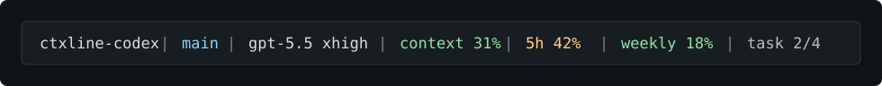

# Codex Status Line

A lightweight, zero-config status-line preset for Codex CLI.

`ctxline-codex` configures Codex's native TUI status line. It does not install a command hook, read credentials, or call any usage API.



## Install

```bash
npx ctxline-codex
```

Then restart Codex or start a new session.

## Install From GitHub

If this package has not been published to npm yet, install it straight from GitHub:

```bash
npm install -g https://github.com/yapdianang/ctxline-codex.git
ctxline-codex
```

Or clone it first if you want to inspect or edit the package:

```bash
gh repo clone yapdianang/ctxline-codex
cd ctxline-codex
npm install -g .
ctxline-codex
```

To verify what will change before writing your Codex config:

```bash
ctxline-codex --dry-run
ctxline-codex doctor
```

When installing from this checkout:

```bash
npm install
node bin/ctxline-codex.js
```

## Uninstall

```bash
npx ctxline-codex uninstall
```

Uninstall restores the prior `status_line` and `status_line_use_colors` values saved during install. If you edit the status line after installing, uninstall will stop instead of overwriting your edits; use `--force` to restore the saved values anyway.

## What It Shows

| Segment | Detail |
|---|---|
| Directory | Current working directory |
| Git | Current branch, when available |
| Model | Active model and reasoning effort |
| Context | Context-window usage |
| Current | 5-hour usage limit, when Codex has it |
| Weekly | Weekly usage limit, when Codex has it |
| Task | Current task progress, when available |

The installed preset is:

```toml
[tui]
status_line = ["current-dir", "git-branch", "model-with-reasoning", "context-used", "five-hour-limit", "weekly-limit", "task-progress"]
status_line_use_colors = true
```

## How It Works

Codex exposes built-in TUI status-line items through `~/.codex/config.toml`.
`ctxline-codex` updates only the `[tui]` status-line keys, creates a timestamped config backup, and stores the previous values in `~/.codex/ctxline-codex.json` so uninstall can restore them.

Set `CODEX_HOME` to install into a different Codex home:

```bash
CODEX_HOME=/tmp/codex-home ctxline-codex --dry-run
```

By default, Codex reads `~/.codex/config.toml` on the machine where Codex is running. If you use Codex on multiple machines, run `ctxline-codex` once on each machine or copy the `[tui]` block into each machine's `~/.codex/config.toml`.

## Commands

```bash
ctxline-codex              # install
ctxline-codex uninstall    # restore previous values
ctxline-codex doctor       # show current Codex status-line state
ctxline-codex preset       # print the preset TOML value
```

## Notes

Claude Code supports an external `statusLine.command` hook, which is why `ctxline-claude` ships a renderer script. Codex CLI already renders status-line segments internally, so this package configures the native Codex TUI instead.

## License

MIT
